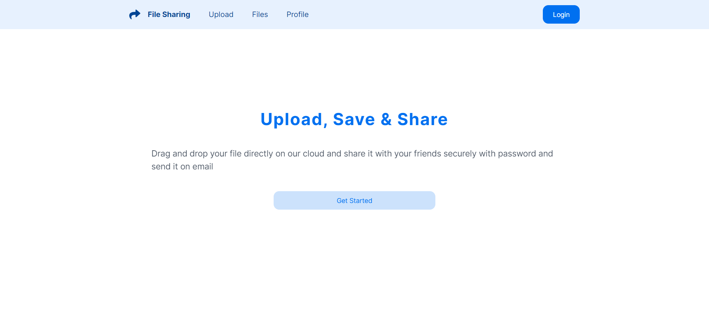
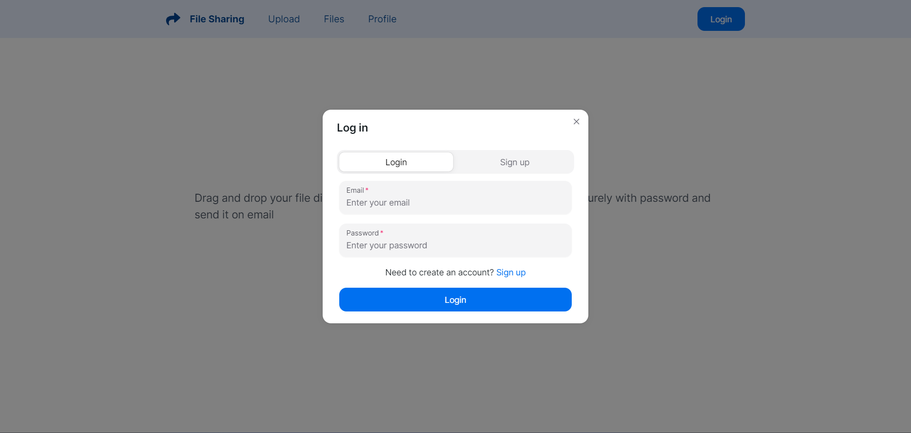
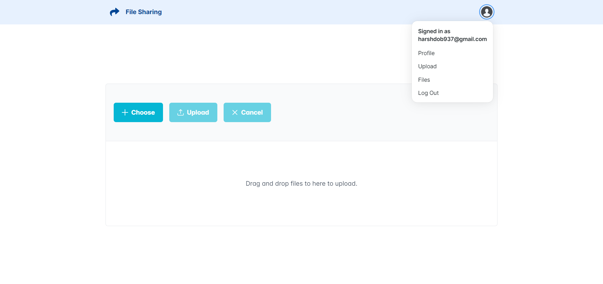
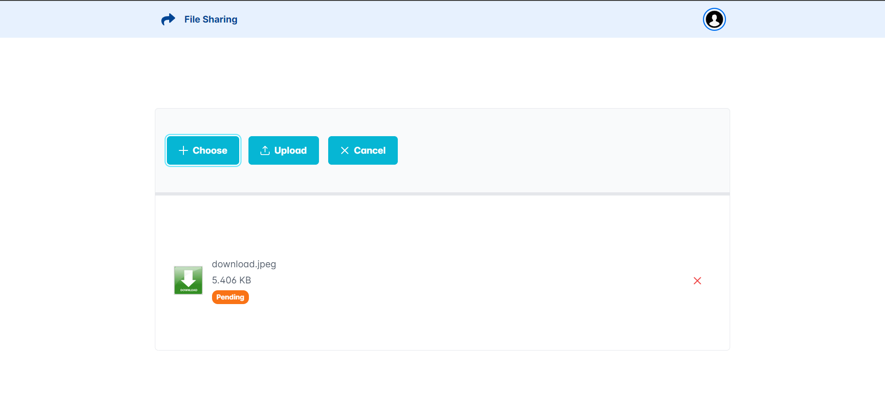
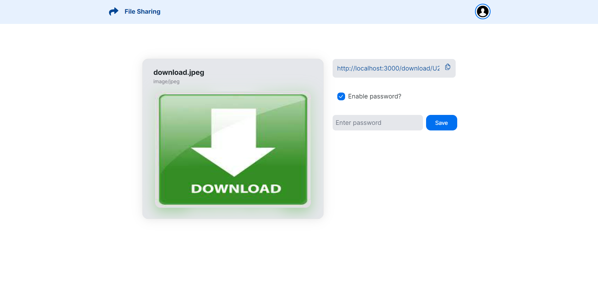
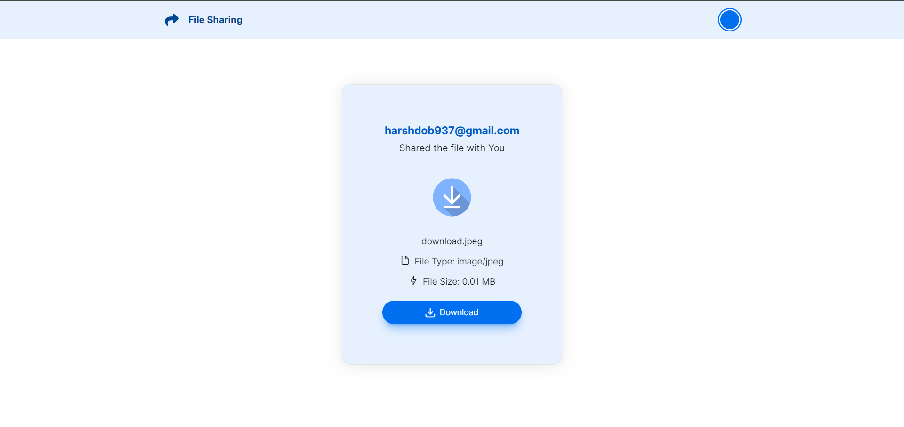
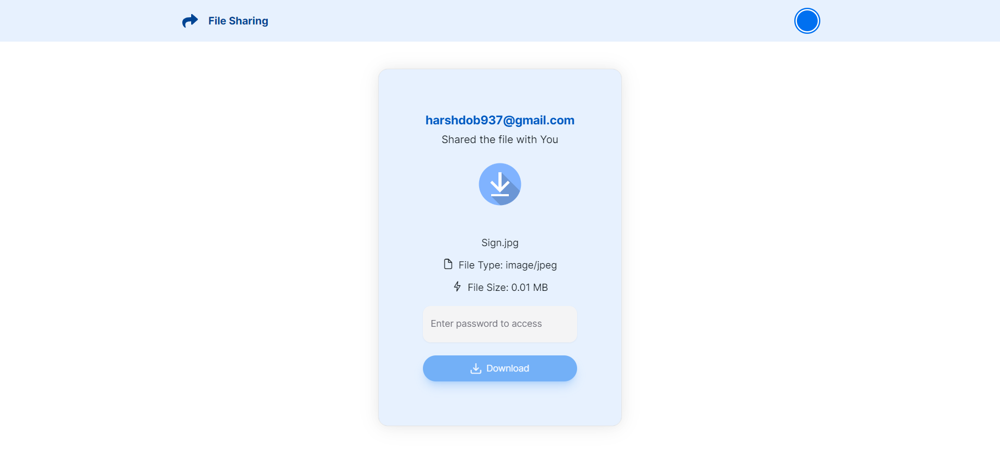
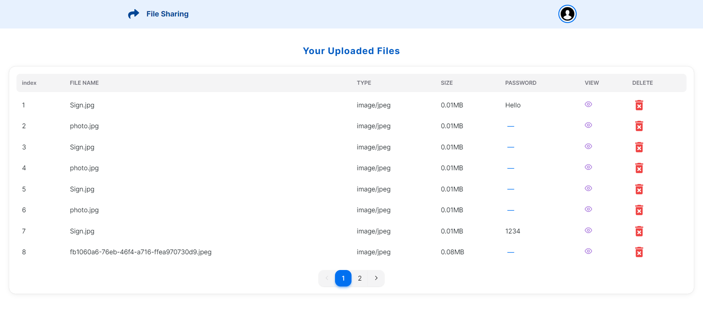

# CodeShare

<!-- PROJECT LOGO -->
<br />
<p align="center">
  <a href="https://github.com/othneildrew/Best-README-Template">
    
  </a>

  <h3 align="center">File Share</h3>

  <p align="center">
    <br />
    <a href="https://github.com/harshil-270/FileShare/issues">Report Bug</a>
    ·
    <a href="https://github.com/harshil-270/FileShare/issues">Request Feature</a>
  </p>
</p>


<!-- TABLE OF CONTENTS -->
<details open="open">
  <summary>Table of Contents</summary>
  <ol>
    <li>
      <a href="#about-the-project">About The Project</a>
      <ul>
        <li><a href="#features">Features</a></li>
        <li><a href="#built-with">Built With</a></li>
      </ul>
    </li>
    <li>
      <a href="#getting-started">Getting Started</a>
      <ul>
        <li><a href="#installation">Installation</a></li>
      </ul>
    </li>
    <li><a href="#contributing">Contributing</a></li>
    <li><a href="#contact">Contact</a></li>
  </ol>
</details>


<!-- ABOUT THE PROJECT -->
## About The Project

### Features

- FileShare is a robust and user-friendly file-sharing platform designed to streamline the process of uploading, managing, and securing your files. This project ensures a seamless and secure experience for users. <br />
- Users can easily upload their files, documents, or any digital content through a simple and intuitive interface. Whether it's images, documents, or multimedia files, FileShare supports a wide range of file types.<br/>
- Once files are uploaded, users have full control and visibility over their content. The platform provides a comprehensive dashboard where users can view a list of all their uploaded files, making it easy to organize and track their digital assets.<br/>
- For added security, FileShare allows users to set individual passwords for each uploaded file. This ensures that sensitive or private content remains accessible only to those with the correct credentials.<br/>
- Leveraging Firebase for authentication, FileShare ensures a robust and secure login process. Users can trust that their account information and uploaded files are protected using industry-standard security measures.<br />
- Need to clean up your digital space? FileShare simplifies file management by providing users with the option to delete all uploaded files in one go. This feature ensures a hassle-free way to declutter and maintain an organized file repository. <br />

### Built With

* [NextJS](https://nextjs.org/)
* [TypeScript](https://www.typescriptlang.org/)
* [FireBase](https://firebase.google.com/docs/)

<!-- GETTING STARTED -->
## Getting Started

This is an example of how you may give instructions on setting up your project locally.
To get a local copy up and running follow these simple example steps.

### Installation


Fork, then download or clone the repo.
```bash
git clone https://github.com/HD1511/FileShare.git
```

For **application**, install the dependencies once via the terminal.
```bash
cd FileShare
npm install
```

Create .env file in FileShare folder and set the below code.
```bash
NEXT_PUBLIC_SECRET = (Use any secret value for your choice)
NEXT_PUBLIC_FIREBASE_API_KEY =
NEXT_PUBLIC_FIREBASE_AUTH_DOMAIN =
NEXT_PUBLIC_FIREBASE_PROJECT_ID =
NEXT_PUBLIC_FIREBASE_STORAGE_BUCKET =
NEXT_PUBLIC_FIREBASE_MESSAGING_SENDER_ID =
NEXT_PUBLIC_FIREBASE_APP_ID =
NEXT_PUBLIC_FIREBASE_MEASUREMENT_ID =
```

Use firebase and all others values you can get there after initialization of web project.

Now you are ready to run the application.

<br />

<!-- CONTRIBUTING -->
## Contributing

Contributions are what make the open source community such an amazing place to be learn, inspire, and create. Any contributions you make are **greatly appreciated**.

1. Fork the Project
2. Create your Feature Branch (`git checkout -b feature/AmazingFeature`)
3. Commit your Changes (`git commit -m 'Add some AmazingFeature'`)
4. Push to the Branch (`git push origin feature/AmazingFeature`)
5. Open a Pull Request


<!-- CONTACT -->
## Contact

Harsh Dobariya- [@Harsh Dobariya](https://www.linkedin.com/in/harsh-dobariya-718908226/) - harshdob937@gmail.com

Project Link: [https://github.com/HD1511/FileShare](https://github.com/HD1511/FileShare)


<!-- MARKDOWN LINKS & IMAGES -->
<!-- https://www.markdownguide.org/basic-syntax/#reference-style-links -->







